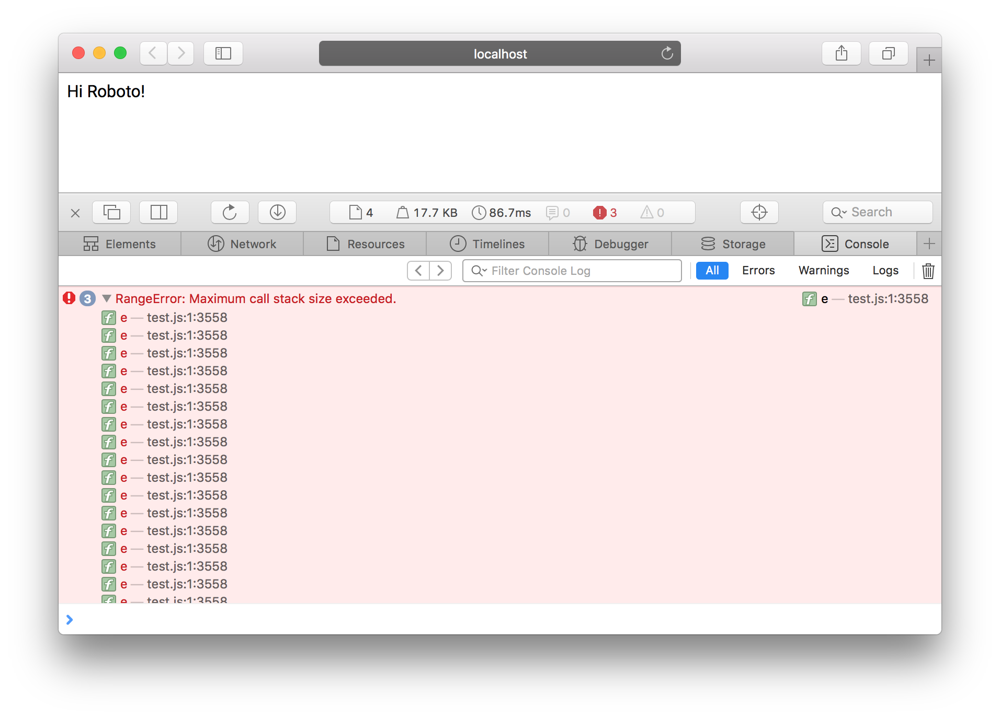

# Demo

Reduced test case for https://github.com/bramstein/fontfaceobserver/issues/14#issuecomment-263651448

When using Webpack with `UglifyJsPlugin` and `mangle: { 'keep_fnames': true }` to bundle a file requiring `fontfaceobserver`, Safari 10 will fail with `RangeError: Maximum call stack size exceeded.`.



## Start on http://localhost:8080

```
$ npm i
$ npm start
```
